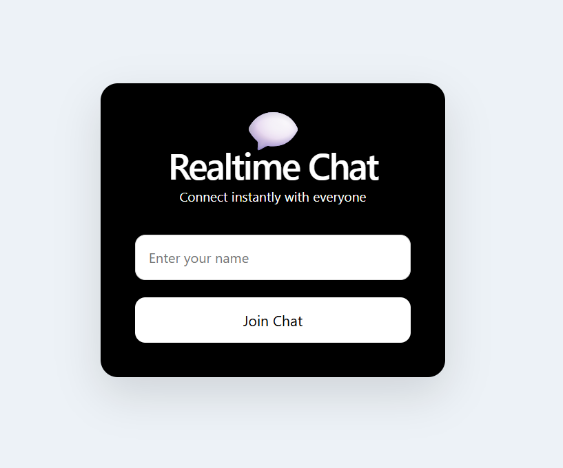
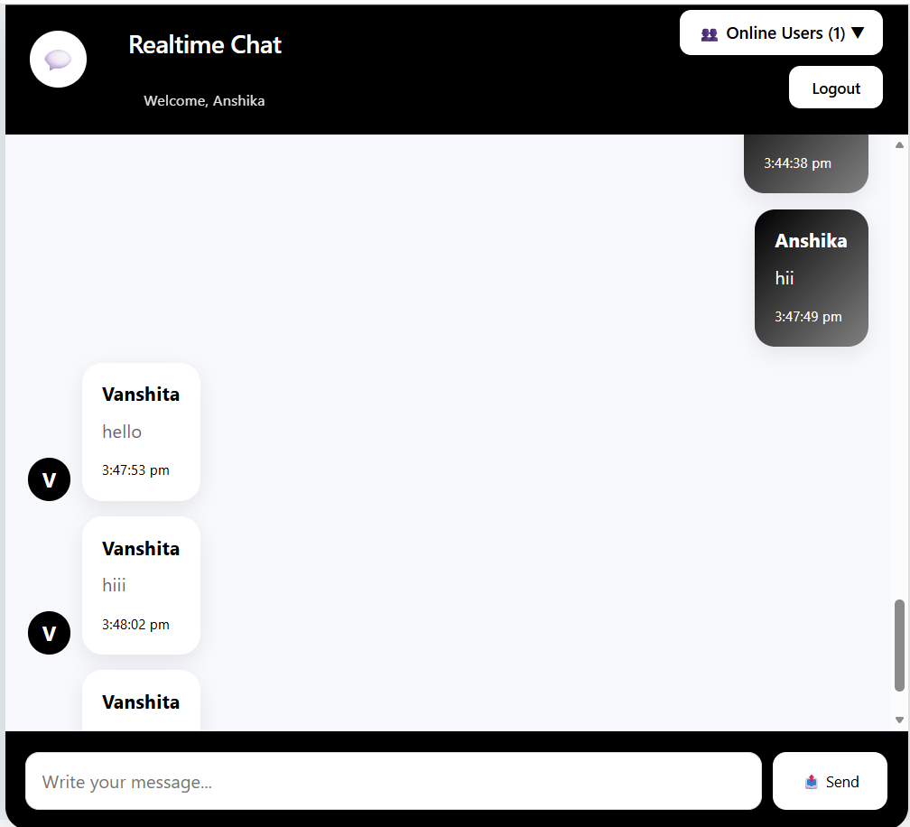
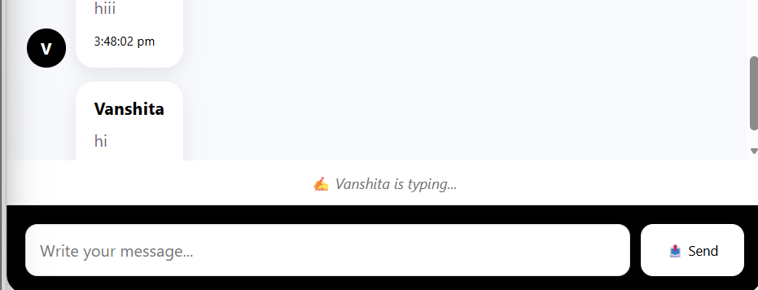
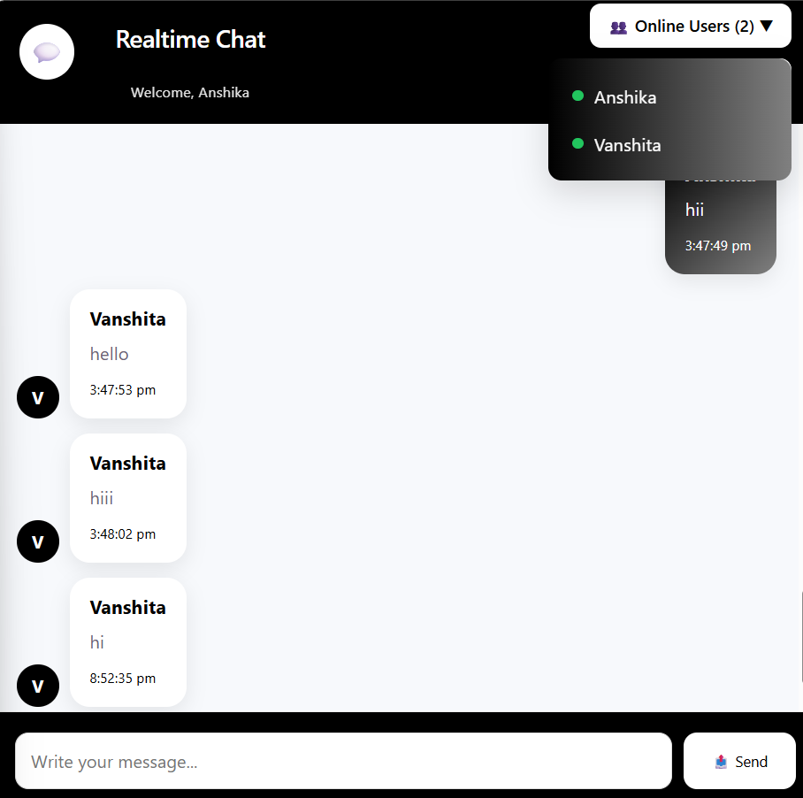
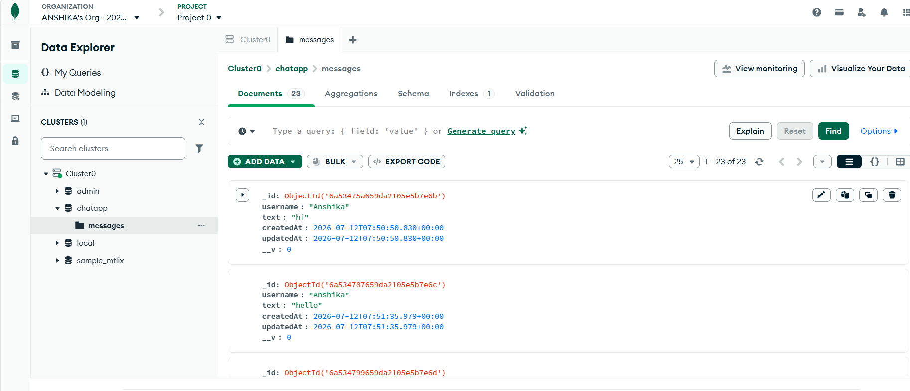

# 💬 Real-Time Chat Application

A full-stack Real-Time Chat Application built using **React.js**, **Node.js**, **Express.js**, **MongoDB Atlas**, and **Socket.io**. The application enables users to exchange messages instantly with persistent chat history and a clean, responsive interface.

---

## 🚀 Features

- 🔐 Username-based Login
- 💬 Real-Time Messaging using Socket.io
- 📜 Persistent Chat History (MongoDB)
- ⏰ Message Timestamps
- 👤 Online Users List
- ⌨️ Typing Indicator
- 🔄 Auto Scroll to Latest Message
- 🚪 Logout Functionality
- 📱 Responsive UI
- 🌐 Backend Deployed on Render

---

## 🛠️ Tech Stack

### Frontend
- React.js (Vite)
- Axios
- Socket.io Client
- CSS3

### Backend
- Node.js
- Express.js
- Socket.io
- MongoDB Atlas
- Mongoose

### Deployment
- Render (Backend)
- GitHub

---

## 📂 Project Structure

```
realtime-chat-app
│
├── frontend
│   ├── src
│   ├── public
│   └── package.json
│
├── backend
│   ├── models
│   ├── routes
│   ├── controllers
│   ├── server.js
│   └── package.json
│
└── README.md
```

---

## ⚙️ Installation

### Clone Repository

```bash
git clone https://github.com/anshika2410-hub/realtime-chat-app.git
```

### Backend

```bash
cd backend
npm install
npm run dev
```

### Frontend

```bash
cd frontend
npm install
npm run dev
```

---

## 🔑 Environment Variables

Create a `.env` file inside the backend folder.

```env
PORT=5000
MONGO_URI=your_mongodb_connection_string
```

---

## 📡 API Endpoints

### Get Messages

```
GET /api/messages
```

### Send Message

```
POST /api/messages
```

Request Body

```json
{
  "username": "Anshika",
  "text": "Hello World"
}
```

---

## 🌐 Live Backend

https://realtime-chat-app-bwk8.onrender.com/

### API

https://realtime-chat-app-bwk8.onrender.com/api/messages

---

## 📸 Screenshots

## Login Screen



---

## Chat Interface



---


## Typing Indicator



---

## Online Users



---

## MongoDB Atlas Database



---


## 🎯 Future Improvements

- Message Delivered & Seen Status
- Private One-to-One Chat
- File & Image Sharing
- Emoji Support
- User Authentication
- Dark Mode
- Notifications

---

## 👩‍💻 Author

**Anshika Agrawal**

GitHub:
https://github.com/anshika2410-hub | Email:anshikaagrawal2410@gmail.com
